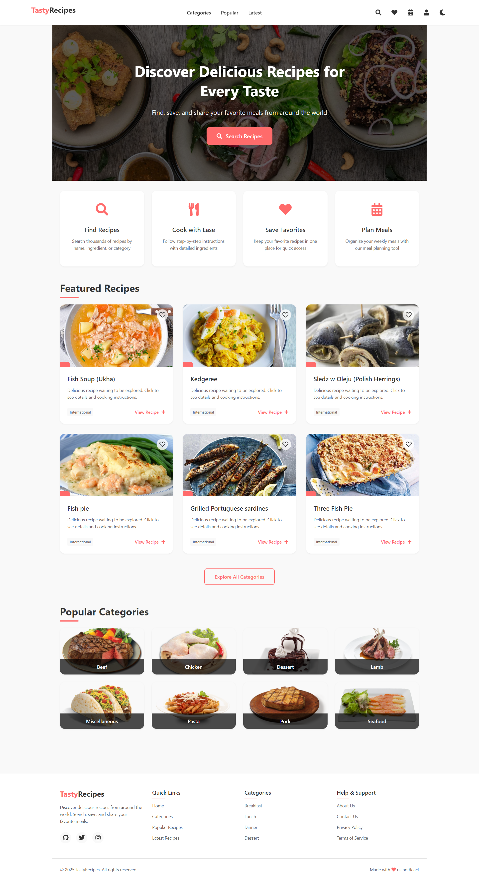

# Recipe React App

A modern, responsive, and feature-rich web application built with React for browsing, searching, and organizing recipes.



## Table of Contents

- [Features](#features)
- [Tech Stack](#tech-stack)
- [Architecture](#architecture)
- [Getting Started](#getting-started)
  - [Prerequisites](#prerequisites)
  - [Installation](#installation)
  - [Running the App](#running-the-app)
- [Configuration](#configuration)
- [Project Structure](#project-structure)
- [Contributing](#contributing)
- [License](#license)
- [Authors](#authors)

## Features

- Browse recipes by category: breakfast, lunch, dinner, desserts.
- Search recipes by keyword with debounce.
- Detailed recipe view: ingredients, steps, nutritional info, images.
- Save and manage favorite recipes.
- Weekly meal planner with drag-and-drop support.
- User authentication: register, login (email/password), social login (Google, Facebook).
- Light and dark theme toggle.
- Responsive design for mobile, tablet, and desktop.
- Smooth animations and page transitions using Framer Motion.
- Global notifications and loading indicators.
- Form validation and error handling.

## Tech Stack

- **Frontend:** React 18, React Router DOM
- **State Management:** Redux Toolkit, Redux Thunk
- **Styling:** Styled Components, CSS variables
- **Animations:** Framer Motion
- **Icons:** React Icons (Font Awesome)
- **Build Tool:** Create React App

## Architecture

The application follows a feature-based folder structure:

- **components/**: Reusable UI components (layout, recipe cards, modals).
- **pages/**: Route-level components (Home, Login, Profile, etc.).
- **redux/**: State slices and store configuration.
- **hooks/**: Custom React hooks.
- **styles/**: Global styles and theme provider.
- **utils/**: API client and helper functions.

## Getting Started

### Prerequisites

- Node.js >= 14.x
- npm >= 6.x

### Installation

```bash
git clone https://github.com/hamza-asdif/Recipes-ReactApp.git
cd react-reciept-app/main-react
npm install
```

### Running the App

```bash
npm start
```

Open http://localhost:3000 in your browser.

To build for production:

```bash
npm run build
```

## Configuration

Create a `.env` file in the root of `main-react`:

```dotenv
REACT_APP_API_URL=https://api.example.com
```

## Project Structure

```
main-react/
├── public/
│   ├── demo.png
│   └── index.html
├── src/
│   ├── components/
│   │   ├── layout/
│   │   ├── recipe/
│   │   └── ui/
│   ├── hooks/
│   ├── pages/
│   ├── redux/
│   ├── styles/
│   ├── utils/
│   └── index.js
├── .env
├── README.md
└── package.json
```

## Contributing

Contributions are welcome! Please:

1. Fork the repository.
2. Create a new branch: `git checkout -b feature/my-feature`
3. Commit your changes: `git commit -m 'Add some feature'`
4. Push to the branch: `git push origin feature/my-feature`
5. Open a pull request.

## License

This project is licensed under the MIT License. See the [LICENSE](LICENSE) file for details.

## Authors

- Hamza Asdif – [GitHub](https://github.com/hamza-asdif)
